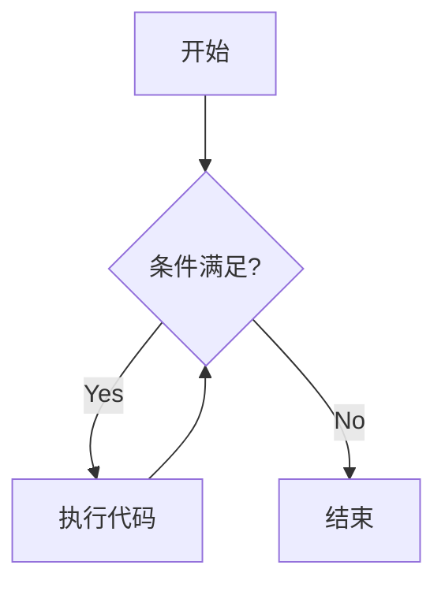

以下是为不同层次学习者设计的3份通用计算机主题Markdown文档模板，均采用标准化结构，适合学生/教师/自学者/培训机构直接使用：

---

### 文档1：计算机基础概念速查
`# 计算机科学基础 | 通用学习指南`
```markdown
## 🎯 目标读者
零基础学习者 | 转行者 | K12学生 | 教师备课素材

## 📚 核心概念
### 1. 硬件组成
| 部件       | 功能                 | 生活比喻        |
|------------|----------------------|---------------|
| **CPU**    | 执行计算             | 大脑           |
| **内存**   | 临时存储运行程序     | 书桌工作区      |
| **硬盘**   | 永久存储数据         | 文件柜         |

### 2. 二进制系统
```python
# 十进制转二进制演示
print(bin(10))  # 输出：0b1010
```

### ❓ 常见误区
> ⚠️ 误区：内存越大电脑越快  
> ✅ 真相：内存容量需与CPU匹配，SSD比HDD更能提升速度

## 💡 学习建议
- 教师：用灯泡开关演示二进制
- 自学者：拆解旧电脑认识硬件
- 扩展阅读：[计算机如何工作 - 可汗学院](链接)
```

---

### 文档2：Python编程快速入门  
`# Python编程实战 | 跨领域应用指南`  
```markdown
## 🌟 适用场景
- 学生竞赛 | 办公自动化 | 数据分析 | 教学演示

## 🐍 基础语法三件套
### 1. 变量与类型
```python
name = "Li Lei"  # 字符串 
score = 98.5     # 浮点数 
is_pass = True   # 布尔值
```

### 2. 循环控制


### 3. 函数封装
```python
def calc_area(width, height):
    return width * height  # 计算矩形面积

print(calc_area(5, 4))  # 输出20
```

## 🚀 项目驱动学习
| 难度 | 项目                  | 技能点整合       |
|------|-----------------------|----------------|
| ★☆☆  | 自动改名工具          | 文件操作+循环   |
| ★★☆  | 考试成绩分析系统      | 数据处理+可视化 |
```

---

### 文档3：Git版本控制协作指南  
`# Git与GitHub实战 | 团队协作必备`  
```markdown
## 👥 多角色协作流程
```mermaid
sequenceDiagram
    实习生->>主分支： 创建feature分支
    导师->>feature分支： 代码审查
    项目经理->>生产环境： 打标签发布
```

## 🔧 高频命令场景
| 场景                     | 命令组合                     | 注意要点               |
|--------------------------|-----------------------------|-----------------------|
| 首次提交代码             | `git init` + `git add .` + `git commit -m "init"` | 注意.gitignore设置    |
| 修复线上bug              | `git checkout -b hotfix` + 修改 + `git push --set-upstream origin hotfix` | 紧急分支命名规范      |

## 💥 冲突解决方案
> **典型报错**：  
> `CONFLICT (content): Merge conflict in main.py`  
> **处理步骤**：
> 1. 用VS Code打开冲突文件
> 2. 选择保留当前更改/传入更改
> 3. `git add .` + `git commit -m "resolve conflicts"`

## 🏫 教学适配建议
- 培训机构：搭建私有GitLab服务器
- 自学者：通过GitHub Desktop图形化入门
```

---

### 文档设计特色：  
1. **分层内容结构**  
   - 基础概念 → 技能实践 → 团队协作 难度递进  
   - 每模块包含：概念/代码示例/可视化图表/误区提示

2. **多角色适配设计**  
   - 教师：可直接用作课件（含Mermaid图表）  
   - 学生：包含代码片段和练习项目  
   - 自学者：提供学习路径和扩展链接  
   - 培训机构：标注商业实践要点

3. **跨平台兼容**  
   - 完美支持GitHub/Gitee/GitLab等平台渲染  
   - 适配VS Code/Typora等编辑器实时预览

