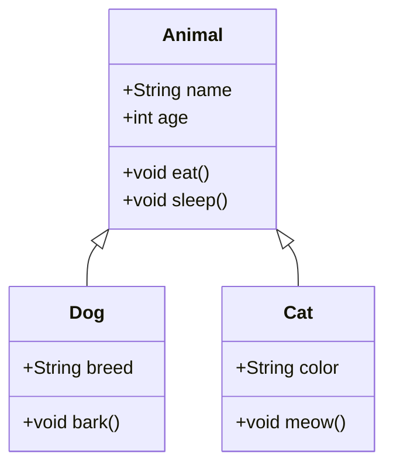

# Java编程核心知识图谱
`Java从环境搭建到实战应用 | 通用学习框架`

## 🎯 目标读者
零基础入门 | 转行开发者 | 高校学生 | 教学备课

## ⚙️ 开发环境搭建
### 1. JDK安装与配置

```bash
# Windows环境变量配置示例
JAVA_HOME = C:\Program Files\Java\jdk-21
PATH = %JAVA_HOME%\bin;...
```

> 📌 **避坑指南**：
> - 安装路径避免使用中文或空格
> - 验证安装：`java -version`
> - 配置后重启命令行工具生效

### 2. IDE选择对比

| 工具          | 适用场景          | 学习曲线 | 推荐版本     |
|---------------|-------------------|----------|--------------|
| IntelliJ IDEA | 企业级开发        | ★★★      | Ultimate     |
| Eclipse       | 教学/旧项目维护   | ★★☆      | 2023-06      |
| VS Code       | 轻量级练习        | ★☆☆      | 最新稳定版   |

---

## 📝 基础语法精要
### 1. 数据类型与流程控制

```java
// 基础类型+分支循环示例
public class GradeEvaluator {
    public static void main(String[] args) {
        int score = 90;
        
        if(score >= 90) {
            System.out.println("优秀！");
        } else if(score >= 80) {
            System.out.println("良好！");
        } else if(score >= 60) {
            System.out.println("及格！");
        } else {
            System.out.println("不及格，需要努力！");
        }
        
        // 循环示例
        for(int i = 1; i <= 5; i++) {
            System.out.println("第" + i + "次循环");
        }
    }
}
```

### 2. 面向对象核心概念



> 💡 **教学建议**：
> - 类 = 汽车设计蓝图
> - 对象 = 根据蓝图制造的实车
> - 继承 = 轿车继承汽车的基本特性

---

## 🧩 异常处理机制
### 分层处理策略

```java
import java.io.*;

public class FileProcessor {
    public static void main(String[] args) {
        try {
            // 尝试打开文件
            BufferedReader reader = new BufferedReader(
                new FileReader("data.txt")
            );
            
            // 读取文件内容
            String line;
            while((line = reader.readLine()) != null) {
                System.out.println(line);
            }
            
        } catch (FileNotFoundException e) {
            System.out.println("错误：文件未找到！");
        } catch (IOException e) {
            System.out.println("错误：读取文件时出错");
        } finally {
            System.out.println("资源清理已完成");
        }
    }
}
```

⚠️ **常见误区与最佳实践**：
1. **精确捕获**：先捕获具体异常（如`FileNotFoundException`），再捕获通用异常（如`Exception`）
2. **资源管理**：使用try-with-resources确保资源关闭
3. **异常信息**：记录完整堆栈信息`e.printStackTrace()`
4. **避免空捕获**：不要使用空的catch块忽略异常

---

## 📦 集合框架实战

### 三大集合对比

| 接口   | 特点         | 线程安全 | 典型用例              | 实现类              |
|--------|--------------|----------|-----------------------|---------------------|
| List   | 有序可重复   | ❌        | 学生名单存储          | ArrayList, LinkedList |
| Set    | 无序唯一     | ❌        | 用户ID去重           | HashSet, TreeSet     |
| Map    | 键值对存储   | ❌        | 商品ID→价格映射      | HashMap, TreeMap     |

### HashMap使用示例

```java
import java.util.*;

public class ProductManager {
    public static void main(String[] args) {
        // 创建商品价格映射
        Map<String, Double> productPrices = new HashMap<>();
        
        // 添加商品
        productPrices.put("iPhone15", 6999.0);
        productPrices.put("GalaxyS24", 5999.0);
        productPrices.put("Xiaomi14", 3999.0);
        
        // 查询价格
        String productName = "iPhone15";
        if(productPrices.containsKey(productName)) {
            double price = productPrices.get(productName);
            System.out.println(productName + " 价格: ¥" + price);
        } else {
            System.out.println("未找到商品: " + productName);
        }
        
        // 遍历所有商品
        System.out.println("\n所有商品价格:");
        for(Map.Entry<String, Double> entry : productPrices.entrySet()) {
            System.out.println(entry.getKey() + ": ¥" + entry.getValue());
        }
    }
}
```

---

## ⚡ 多线程与IO流
### 1. 线程创建与同步

```java
// 实现Runnable接口创建线程
class DataProcessor implements Runnable {
    private final String taskName;
    
    public DataProcessor(String name) {
        this.taskName = name;
    }
    
    @Override
    public void run() {
        System.out.println(taskName + " 开始执行");
        try {
            // 模拟耗时操作
            Thread.sleep(2000);
        } catch (InterruptedException e) {
            e.printStackTrace();
        }
        System.out.println(taskName + " 执行完成");
    }
}

public class MultiThreadDemo {
    public static void main(String[] args) {
        System.out.println("主线程开始");
        
        // 创建线程池（推荐方式）
        ExecutorService executor = Executors.newFixedThreadPool(2);
        
        executor.execute(new DataProcessor("任务A"));
        executor.execute(new DataProcessor("任务B"));
        
        // 关闭线程池
        executor.shutdown();
        System.out.println("主线程结束");
    }
}
```

### 2. 文件读写最佳实践

```java
import java.io.*;
import java.nio.file.*;

public class FileOperations {
    public static void main(String[] args) {
        String filePath = "data.txt";
        
        // 写入文件（自动关闭资源）
        try (BufferedWriter writer = Files.newBufferedWriter(Paths.get(filePath))) {
            writer.write("姓名,年龄,成绩");
            writer.newLine();
            writer.write("张三,20,95");
            writer.newLine();
            writer.write("李四,22,88");
        } catch (IOException e) {
            e.printStackTrace();
        }
        
        // 读取文件（自动关闭资源）
        try (BufferedReader reader = Files.newBufferedReader(Paths.get(filePath))) {
            System.out.println("文件内容:");
            String line;
            while ((line = reader.readLine()) != null) {
                System.out.println(line);
            }
        } catch (IOException e) {
            e.printStackTrace();
        }
    }
}
```

---

## 🚀 学习路线图

```mermaid
gantt
    title Java百日进阶计划
    dateFormat  YYYY-MM-DD
    axisFormat  %m/%d
    
    section 基础阶段
    Java语法基础      ：active,  base1, 2025-08-01, 10d
    面向对象编程      ：         base2, after base1, 14d
    集合框架         ：         base3, after base2, 7d
    
    section 进阶阶段
    IO与多线程       ：         adv1,  after base3, 10d
    网络编程         ：         adv2,  after adv1,  7d
    数据库连接       ：         adv3,  after adv2,  7d
    
    section 项目实战
    学生管理系统      ：         proj1, after adv3,  14d
    电商平台后端      ：         proj2, after proj1, 21d
```

---

## 💎 多角色学习指南

### 👨‍🏫 教师使用建议
1. **课堂演示**：使用Mermaid类图讲解继承关系
2. **实验设计**：提供TODO标记的代码片段让学生补全
3. **项目驱动**：分阶段实现学生管理系统
4. **考核方式**：代码审查+单元测试通过率

### 👨‍🎓 学生自学路径
1. **每日练习**：完成路线图中当日任务
2. **代码托管**：在GitHub创建学习仓库
3. **问题解决**：Stack Overflow搜索错误信息
4. **技能巩固**：LeetCode刷题（Java实现）

### 🏫 培训机构课程设计
| 模块       | 课时 | 重点内容                  | 配套项目       |
|------------|------|---------------------------|---------------|
| Java核心   | 40h  | OOP/集合/异常处理         | 银行账户系统  |
| 高级特性   | 30h  | 多线程/网络编程/JDBC      | 在线聊天室    |
| 企业框架   | 50h  | Spring Boot/MyBatis       | 电商平台后端  |
| 项目实战   | 60h  | 微服务架构/DevOps         | 云笔记系统    |

---

## 📚 推荐资源
1. **官方文档**：[Oracle Java Documentation](https://docs.oracle.com/en/java/)
2. **免费教程**：[廖雪峰的Java教程](https://www.liaoxuefeng.com/wiki/1252599548343744)
3. **视频课程**：[B站-狂神说Java](https://space.bilibili.com/95256449)
4. **练习平台**：[LeetCode](https://leetcode.com/) | [牛客网](https://www.nowcoder.com/)

