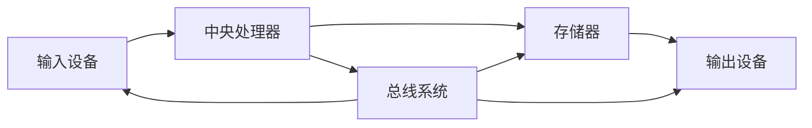
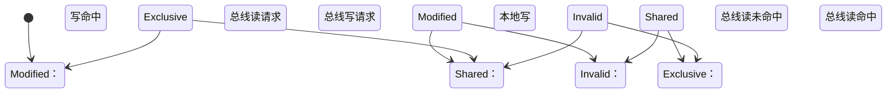
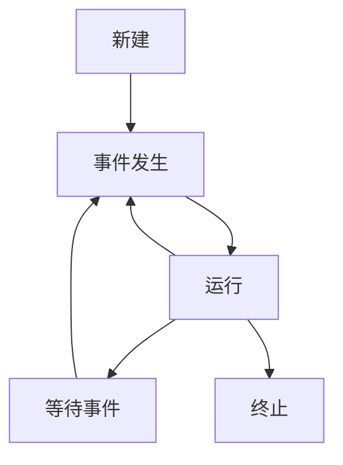
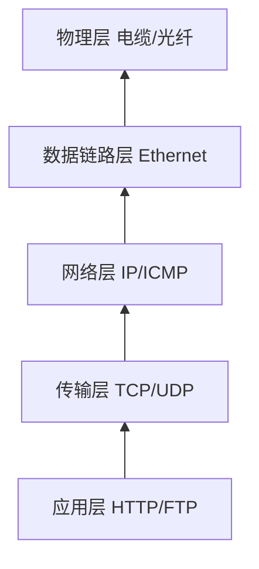

# 计算机系统核心原理
`计算机组成与系统架构 | 专业学习指南`

## 🎯 目标读者
计算机专业学生 | 硬件工程师 | 系统架构师 | 高校教师

## 🧠 计算机体系结构概览


### 冯·诺依曼体系五大组件
1. **运算器(ALU)** - 算术逻辑运算单元
2. **控制器(CU)** - 指令解码与执行控制
3. **存储器(Memory)** - 数据与指令存储
4. **输入设备(Input)** - 信息输入通道
5. **输出设备(Output)** - 结果输出通道

---

## 🔢 数据表示与数字逻辑
### 1. 数值编码系统

| 表示法       | 优点                 | 缺点         | 应用场景        |
|--------------|----------------------|-------------|----------------|
| 原码         | 直观简单            | ±0问题       | 早期计算机      |
| 反码         | 统一加减法          | ±0问题       | 过渡方案        |
| **补码**     | 解决±0问题          | 转换复杂     | **现代计算机**  |
| 移码         | 方便浮点数比较      | 不直观       | 浮点数阶码      |

### 2. 逻辑门电路实现
```verilog
// 1位全加器Verilog实现
module FullAdder(
    input a, b, cin,
    output sum, cout
);
    assign sum = a ^ b ^ cin;
    assign cout = (a & b) | (cin & (a ^ b));
endmodule
```

### 3. 布尔代数化简
```plaintext
F(A,B,C) = Σ(0,2,4,5,6)
简化过程：
F = A'B'C' + A'BC' + AB'C' + AB'C + ABC'
   = A'C'(B'+B) + AB'(C'+C) + ABC'
   = A'C' + AB' + ABC'
   = A'C' + AB'(1 + C)
   = A'C' + AB'
```

---

## 💻 处理器架构设计

### 经典五级流水线


### 指令集架构对比

| 特性          | RISC(精简指令集)       | CISC(复杂指令集)       |
|---------------|------------------------|------------------------|
| 指令数量       | 少(~100条)             | 多(~300条)             |
| 指令长度       | 固定长度               | 可变长度               |
| 执行周期       | 单周期为主             | 多周期为主             |
| 译码复杂度     | 简单                   | 复杂                   |
| 寄存器数量     | 多(≥32)                | 少(~8)                 |
| 代表架构       | ARM, RISC-V            | x86                    |

### MIPS指令格式示例
```asm
# MIPS汇编示例
        .data
array:  .word 0:10       # 10个元素的数组

        .text
        li $t0, 0        # 循环计数器
        li $t1, 10       # 数组长度
        la $s0, array    # 数组基址

loop:
        sw $t0, 0($s0)   # 存储计数器值
        addi $s0, $s0, 4 # 地址+4
        addi $t0, $t0, 1 # 计数器+1
        blt $t0, $t1, loop # 循环判断
```

---

## 🧩 存储器层次结构

### 存储金字塔


### 缓存映射策略对比

| 策略         | 优点                  | 缺点                  | 冲突率 |
|--------------|-----------------------|-----------------------|--------|
| 直接映射     | 硬件简单，速度快      | 冲突率高              | 高     |
| 全相联映射   | 冲突率低              | 硬件复杂，速度慢      | 低     |
| 组相联映射   | 平衡速度与冲突率      | 中等复杂度            | 中     |

### 缓存一致性协议(MESI)


---

## 🖥️ 操作系统核心机制

### 进程状态转换


### 页面置换算法对比

| 算法       | 实现复杂度 | 缺页率 | 特点                     |
|------------|------------|--------|--------------------------|
| FIFO       | ★☆☆        | 高     | 简单但Belady异常         |
| LRU        | ★★☆        | 中     | 基于时间局部性           |
| Clock      | ★★☆        | 中     | LRU近似实现              |
| OPT        | ★★★        | 低     | 理论最优（无法实现）     |

### 文件系统布局示例
```
磁盘布局：
+---------------------+
| 引导块 | 超级块 | inode区 | 数据区 |
+---------------------+

inode结构：
+------------------------+
| 文件类型 | 权限 | 链接数 |
| 文件大小 | 时间戳         |
| 直接指针[12]           |
| 一级间接指针           |
| 二级间接指针           |
| 三级间接指针           |
+------------------------+
```

---

## 🌐 计算机网络体系

### TCP/IP协议栈


### TCP三次握手
```mermaid
sequenceDiagram
    Client->>Server： SYN=1, Seq=x
    Server->>Client： SYN=1, ACK=1, Seq=y, Ack=x+1
    Client->>Server： ACK=1, Seq=x+1, Ack=y+1
```

### IPv4 vs IPv6头部对比

| 字段          | IPv4 (20字节)        | IPv6 (40字节)        |
|---------------|----------------------|----------------------|
| 版本          | 4                    | 6                    |
| 头部长度      | IHL字段              | **固定40字节**       |
| 服务类型      | TOS                  | **流量类别**         |
| 总长度        | 数据包总长           | **载荷长度**         |
| 生存时间      | TTL                  | **跳数限制**         |
| 协议          | 上层协议标识         | **下一头部**         |
| 源地址        | 32位                 | **128位**            |
| 目的地址      | 32位                 | **128位**            |
| 校验和        | 有                   | **无**               |
| 分片          | 支持                 | **源端分片**         |

---

## 🚀 学习路线与资源

### 计算机专业四年规划
```mermaid
gantt
    title 计算机专业核心课程路线
    dateFormat  YYYY-MM
    axisFormat  %Y-%m
    
    section 大一
    程序设计基础    ：a1, 2025-09, 4mo
    离散数学        ：a2, after a1, 2mo
    
    section 大二
    数据结构        ：b1, 2026-09, 3mo
    计算机组成原理   ：b2, after b1, 4mo
    操作系统原理    ：b3, after b2, 4mo
    
    section 大三
    计算机网络      ：c1, 2027-09, 3mo
    数据库系统      ：c2, after c1, 3mo
    编译原理        ：c3, after c2, 3mo
    
    section 大四
    分布式系统      ：d1, 2028-09, 3mo
    毕业设计        ：d2, after d1, 6mo
```

### 经典教材推荐
1. **计算机组成**
    - 《计算机组成与设计：硬件/软件接口》Patterson & Hennessy
    - 《深入理解计算机系统》Bryant & O'Hallaron

2. **操作系统**
    - 《操作系统概念》Silberschatz
    - 《现代操作系统》Tanenbaum

3. **计算机网络**
    - 《计算机网络：自顶向下方法》Kurose & Ross
    - 《TCP/IP详解 卷1：协议》Stevens

---

## 💡 多角色应用指南

### 👨‍🏫 教师教学建议
1. **理论结合实践**：使用Verilog实现简单CPU
2. **可视化教学**：用Mermaid展示状态转换
3. **实验设计**：
    - 缓存命中率实验
    - 页面置换算法模拟
    - 小型操作系统内核开发

### 👨‍🎓 学生学习策略
1. **知识图谱构建**：
   ```mermaid
   graph TD
        A[数字逻辑] --> B[计算机组成]
        B --> C[体系结构]
        C --> D[操作系统]
        D --> E[编译原理]
        E --> F[分布式系统]
   ```
2. **项目驱动**：
    - 5级流水线CPU设计
    - 小型文件系统实现
    - 精简版TCP协议栈

### 🔧 工程师实践方向
| 领域          | 核心技术                     | 工具链                  |
|---------------|----------------------------|-------------------------|
| 芯片设计      | Verilog/VHDL, ASIC流程      | Cadence, Synopsys       |
| 系统架构      | 多核架构, 缓存一致性         | Gem5, MARSSx86          |
| 操作系统开发  | 内核开发, 驱动编程           | Linux Kernel, QEMU      |
| 嵌入式系统    | RTOS, 硬件抽象层             | FreeRTOS, Zephyr        |

